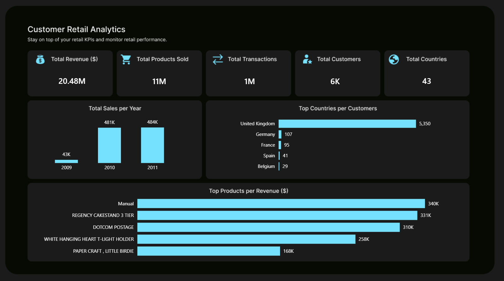

# Customer Retail Analytics

## Project Overview

Customer Retail Analytics is an end-to-end Business Intelligence project focused on analyzing retail transaction data to uncover insights about customer behavior, sales performance, product demand, and geographic reach.

The project demonstrates a complete analytics workflow:

**Raw Transaction Data -> Python Data Cleaning -> SQL Analysis -> Power BI Dashboard -> Business Insights**

The goal is to transform transactional data into meaningful insights that help businesses understand:

- Who their customers are
- Where their customers are located
- Which products drive sales
- How the business is performing over time
- Where growth opportunities exist

---

# Business Problem

Retail businesses generate large amounts of transaction data but often struggle to convert this data into actionable insights.

This analysis helps answer key business questions:

### Customer Insights
- How many customers does the business serve?
- Which countries contribute the most customers?
- What markets represent the biggest opportunities?

### Sales Performance
- How many transactions occur over time?
- What is the total revenue generated?
- How many items have been sold?

### Product Performance
- Which products are most popular?
- Which products generate the highest revenue?
- Which products drive customer demand?

---

# Objectives

The objectives of this project are to:

- Clean and prepare retail transaction data for analysis
- Explore the structure and characteristics of the dataset
- Analyze customer distribution and geographic coverage
- Evaluate sales performance
- Identify top-performing products
- Build an executive Power BI dashboard for decision-making

---

# Dataset

## Online Retail II Dataset

The dataset contains transactional records from a UK-based online retail company selling unique gift products.
The original data workbook contains worksheets grouped by transaction period
The final dataset was a combination of the mutiple data sheets

Dataset source:

[UCI Machine Learning Repository - Online Retail II Dataset](https://archive.ics.uci.edu/dataset/502/online+retail+ii)

### Dataset Information

- Time period: December 2009 - December 2011
- Business type: Online retail / wholesale
- Geography: Multiple countries
- Records: Retail transactions

---

# Dataset Columns

| Column | Description |
|---|---|
| Invoice | Transaction identifier |
| StockCode | Product identifier |
| Description | Product description |
| Quantity | Number of products purchased |
| InvoiceDate | Date and time of transaction |
| Price | Unit price of product |
| Customer ID | Unique customer identifier |
| Country | Customer location |

---

# Tools & Technologies

| Category | Tool | Purpose |
|---|---|---|
| Data Processing | Python (Pandas) | Combining datasets, removing duplicates, handling missing values, cleaning text fields, and converting data types |
| Data Analysis | SQL | Data exploration, customer analysis, sales analysis, and product analysis |
| Report Design | Figma Online | Designing dashboard layouts and report user interface |
| Data Visualization | Microsoft Power BI | Dashboard development, KPI reporting, business storytelling, and interactive visualization |

For more info:
- On queries, check Queries subfolder.
- On data visualization, open Power BI report (.pbix).
